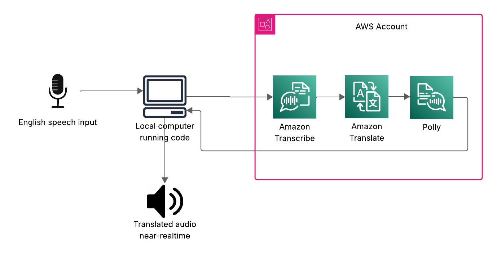

## Acknowledges
This project is an adaptation from this entry blog: https://aws.amazon.com/blogs/machine-learning/break-through-language-barriers-with-amazon-transcribe-amazon-translate-and-amazon-polly/ that explains the context of the base of this project

## Description
On this project we will be using three managed AWS services (Amazon Transcribe (https://aws.amazon.com/transcribe/), Amazon Translate (https://aws.amazon.com/translate/), and Amazon Polly (https://aws.amazon.com/polly/)) to produce a near-real-time speech-to-speech translator solution that seeks help to Capital City Baptist Church Mexico City, this is an International, cross-cultural, trans-denominational church in the heart of a very large city. The importance of this besides on the the quickly translate a source speaker’s live voice input into a spoken, accurate, translated target language, all with zero machine learning (ML) experience.

### Architectural Diagram


### Pre-requisites:

1. Python 3.12.10
2. Linux/UNIX-like OS
3. Amoeba Loopback or any other virtual audio routing tool.
4. Properly configured AWS IAM user with these AWS managed polices:
    - TranslateFullAccess
    - AmazonTranscribeFullAccess
    - AmazonPollyFullAccess
5. AWS CLI
6. Run AWS configure in command prompt to configure the AWS cli with the previously mentioned IAM user secret and access keys. When running the python script, the AWS python library boto3 will look for these necessary security parameters and authorize/authenticate your AWS api calls. 

### Steps to run the bot:

1. Install all the dependencies

```
pip install -r requirements.txt
```

2. For test scenario, we are going to route the audio from a YouTube live stream to the virtual audio routing tool (Loopback) and then select that audio interface in the option shown in the code.

```
YouTube > Loopback > language_assistant.py
```

3. Run the language assistant. it will ask you to pick the speaker device (Virtual Audio  Output Cable) to record from. And pick the direction of translation. 1 for English to Spanish

```
python3 language_assistant.py
```

### Next steps

For live performance, this code will allow us to connect an audio interface like Focusrite https://focusrite.com/categories/audio-interfaces and then send the translated audio to any receiver device for live assistants.

This approach is not only limited to this use case, as it can be applied to any virtual or live conferences in multiple languages, to know all the available languages please refeer to the following link: https://docs.aws.amazon.com/polly/latest/dg/supported-languages.html


## Security

See [CONTRIBUTING](CONTRIBUTING.md#security-issue-notifications) for more information.

## License

This code is licensed under the MIT-0 License. See the LICENSE file.
